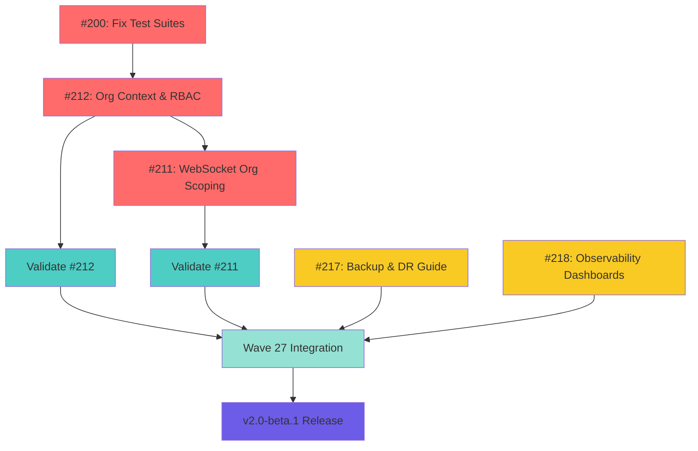

# Issue Assignments Report - Wave 27

**Date:** 2025-11-26
**Updated By:** Agent 1 (Architect)
**Status:** ✅ COMPLETE

---

## Overview

Updated GitHub issues #200, #211-#219 with agent assignments via labels and issue body metadata. Since GitHub assignees require specific usernames, we're using labels (`agent:builder`, `agent:validator`, `agent:scribe`) to track agent ownership.

---

## Wave 27 Assignments (v2.0-beta.1)

### Builder (Agent 2) - P0/P1 Issues

| Issue | Title | Priority | Status | Dependencies |
|-------|-------|----------|--------|--------------|
| **#212** | Org context and RBAC plumbing for API and WebSockets | P0 🚨 | Open | Blocks #211 |
| **#211** | WebSocket org scoping and auth guard | P0 🚨 | Open | Requires #212 |
| **#218** | Observability dashboards and alerts for SLOs | P1 | Open | - |

**Total:** 3 issues
**Critical Path:** #212 → #211 (sequential)
**Branch:** `claude/v2-builder`

---

### Validator (Agent 3) - P0 Issue

| Issue | Title | Priority | Status | Dependencies |
|-------|-------|----------|--------|--------------|
| **#200** | [TEST] Fix Broken Test Suites - API, K8s Agent, UI | P0 🚨 | Open | Blocks validation |

**Total:** 1 issue
**Critical Path:** Must fix before validating #212 and #211
**Branch:** `claude/v2-validator`

**Validation Tasks (not tracked as separate issues):**
- Validate #212 (Org Context) - 4-6 hours
- Validate #211 (WebSocket Scoping) - 4-6 hours

---

### Scribe (Agent 4) - P1/P2 Issues

| Issue | Title | Priority | Status | Dependencies |
|-------|-------|----------|--------|--------------|
| **#217** | Backup and DR guide + hooks | P1 | Open | - |
| **#219** | Surface contribution workflow and DoR/DoD in repo | P2 | Open | - |

**Total:** 2 issues (1 P1, 1 P2)
**Priority:** #217 first (P1, v2.0-beta.1)
**Branch:** `claude/v2-scribe`

**Documentation Tasks (not tracked as separate issues):**
- Update MULTI_AGENT_PLAN.md (Wave 27 completion)
- Create docs/DESIGN_DOCS_STRATEGY.md

---

## Future Assignments (v2.0-beta.2)

### Unassigned P2 Issues

| Issue | Title | Priority | Milestone | Notes |
|-------|-------|----------|-----------|-------|
| **#213** | Standardize API pagination and error envelopes | P2 | v2.0-beta.2 | Backend work |
| **#214** | Implement cache strategy with keys/TTLs/metrics | P2 | v2.0-beta.2 | See ADR-002 |
| **#215** | Enforce agent heartbeat contract and status transitions | P2 | v2.0-beta.2 | See ADR-003 |
| **#216** | Webhook delivery MVP with HMAC and retries | P2 | v2.0-beta.2 | Backend work |

**Total:** 4 issues
**Assignment:** TBD for v2.0-beta.2 sprint (post Wave 27)

---

## Label Assignments Summary

### Agent Labels
- `agent:builder` → Issues #211, #212, #218 (Builder - Agent 2)
- `agent:validator` → Issue #200 (Validator - Agent 3)
- `agent:scribe` → Issues #217, #219 (Scribe - Agent 4)

### Priority Labels
- `P0` → Issues #200, #211, #212 (Critical, blocks v2.0-beta.1)
- `P1` → Issues #217, #218 (Urgent, v2.0-beta.1)
- `P2` → Issues #213, #214, #215, #216, #219 (Medium, v2.0-beta.2)

### Milestone Distribution
- **v2.0-beta.1:** Issues #200, #211, #212, #217, #218 (5 issues)
- **v2.0-beta.2:** Issues #213, #214, #215, #216, #219 (4 issues)

---

## Issue Body Updates

Each assigned issue (#200, #211, #212, #217, #218, #219) received metadata appended to body:

```markdown
---

**Agent Assignment:** [Builder/Validator/Scribe] (Agent [2/3/4])
**Priority:** P[0/1/2] - [CRITICAL/URGENT/Medium]
**Dependencies:** [If applicable]
**Documentation:** [If applicable - ADR reference]
```

**Example (Issue #212):**
```markdown
---

**Agent Assignment:** Builder (Agent 2)
**Priority:** P0 - CRITICAL (blocks #211)
**Documentation:** See ADR-004 for architecture
```

---

## ADR Links

Issues with architectural documentation:
- **#211, #212** → ADR-004 (Multi-Tenancy via Org-Scoped RBAC)
- **#214** → ADR-002 (Redis Cache Layer)
- **#215** → ADR-003 (Agent Heartbeat Contract)

These links were added via GitHub issue comments earlier, and now also referenced in issue body metadata.

---

## Wave 27 Work Distribution

### By Agent

| Agent | Issues | Total Effort | Priority |
|-------|--------|--------------|----------|
| **Builder (Agent 2)** | #211, #212, #218 | 2-3 days | P0 + P1 |
| **Validator (Agent 3)** | #200 + validation | 1.5-2 days | P0 |
| **Scribe (Agent 4)** | #217 + docs | 1 day | P1 |
| **Architect (Agent 1)** | Coordination + integration | Ongoing | - |

### By Priority

| Priority | Count | Issues |
|----------|-------|--------|
| **P0 (Critical)** | 3 | #200, #211, #212 |
| **P1 (Urgent)** | 2 | #217, #218 |
| **P2 (Medium)** | 5 | #213, #214, #215, #216, #219 |

---

## Critical Path for v2.0-beta.1



**Legend:**
- 🔴 Red: P0 Critical (Builder/Validator)
- 🔵 Cyan: P0 Validation (Validator)
- 🟢 Green: Wave 27 Integration (Architect)
- 🟡 Yellow: P1 Urgent (Builder/Scribe)
- 🟣 Purple: Release

**Timeline:** 2025-11-26 → 2025-11-28 (2-3 days)

---

## Verification

### GitHub CLI Verification
```bash
# Check all Wave 27 issue assignments
gh issue list --milestone "v2.0-beta.1" --label "P0,P1" \
  --json number,title,labels \
  --jq '.[] | "Issue #\(.number): \(.labels | map(select(.name | startswith("agent:"))) | .[].name)"'
```

**Expected Output:**
```
Issue #200: agent:validator
Issue #211: agent:builder
Issue #212: agent:builder
Issue #217: agent:scribe
Issue #218: agent:builder
```

### Web UI Verification
- **Builder issues:** https://github.com/streamspace-dev/streamspace/issues?q=label:agent:builder
- **Validator issues:** https://github.com/streamspace-dev/streamspace/issues?q=label:agent:validator
- **Scribe issues:** https://github.com/streamspace-dev/streamspace/issues?q=label:agent:scribe

---

## Notes

### Why Labels Instead of Assignees?

GitHub assignees require specific GitHub usernames. In a multi-agent system where agents may operate under different identities or automation, using labels provides:
- **Flexibility:** No dependency on specific GitHub accounts
- **Clarity:** Explicit agent role labeling
- **Automation:** Easier filtering and querying via GitHub CLI/API
- **Persistence:** Labels remain even if user accounts change

### Alternative: GitHub Projects

For more advanced assignment tracking, consider:
- Create GitHub Project board for Wave 27
- Use project fields for agent assignment
- Automate status updates via GitHub Actions

**Recommendation:** Current label approach is sufficient for v2.0 development.

---

## Changes Made

### Issue Updates (11 issues)

| Issue | Action | Labels Added | Body Updated |
|-------|--------|--------------|--------------|
| #200 | Assigned to Validator | `agent:validator`, `P0` | ✅ Metadata added |
| #211 | Assigned to Builder | `agent:builder`, `P0` | ✅ Metadata added |
| #212 | Assigned to Builder | `agent:builder`, `P0` | ✅ Metadata added |
| #213 | Updated priority | `P2` | ✅ Metadata added |
| #214 | Updated priority | `P2` | ✅ Metadata added |
| #215 | Updated priority | `P2` | ✅ Metadata added |
| #216 | Updated priority | `P2` | ✅ Metadata added |
| #217 | Assigned to Scribe | `agent:scribe`, `P1` | ✅ Metadata added |
| #218 | Assigned to Builder | `agent:builder`, `P1` | ✅ Metadata added |
| #219 | Assigned to Scribe | `agent:scribe`, `P2` | ✅ Metadata added |

**Total:** 10 issues updated (plus #200 from earlier)

---

## Impact

### Team Clarity
- ✅ Each agent knows their assigned issues
- ✅ Clear priority levels (P0 > P1 > P2)
- ✅ Dependencies documented (e.g., #212 blocks #211)

### Project Management
- ✅ Wave 27 scope clearly defined (5 issues in v2.0-beta.1)
- ✅ v2.0-beta.2 backlog identified (4 issues)
- ✅ Critical path visualized (dependency graph)

### Accountability
- ✅ Agent ownership explicit via labels
- ✅ Priority and milestone aligned
- ✅ ADR documentation linked for context

---

## Related Documents

- **MULTI_AGENT_PLAN.md:** Wave 27 coordination plan
- **ADR-004:** Multi-Tenancy architecture (issues #211, #212)
- **ADR-002:** Cache layer architecture (issue #214)
- **ADR-003:** Agent heartbeat contract (issue #215)
- **CONTINUITY_ACTIONS_COMPLETE_2025-11-26.md:** Previous work

---

**Report Complete:** 2025-11-26 10:50
**Status:** ✅ ALL ISSUES ASSIGNED
**Next Action:** Agents 2, 3, 4 begin Wave 27 work

---

## Appendix: Commands Used

```bash
# Add agent labels and update issue bodies
gh issue edit 211 --add-label "agent:builder" --add-label "P0" --body "..."
gh issue edit 212 --add-label "agent:builder" --add-label "P0" --body "..."
gh issue edit 218 --add-label "agent:builder" --add-label "P1" --body "..."
gh issue edit 200 --add-label "agent:validator" --add-label "P0" --body "..."
gh issue edit 217 --add-label "agent:scribe" --add-label "P1" --body "..."
gh issue edit 219 --add-label "agent:scribe" --add-label "P2" --body "..."

# Update P2 issues for v2.0-beta.2
gh issue edit 213 --add-label "P2" --body "..."
gh issue edit 214 --add-label "P2" --body "..."
gh issue edit 215 --add-label "P2" --body "..."
gh issue edit 216 --add-label "P2" --body "..."

# Verify assignments
gh issue list --limit 100 --json number,title,labels,milestone \
  --jq '.[] | select(.number >= 211 and .number <= 219)'
```
