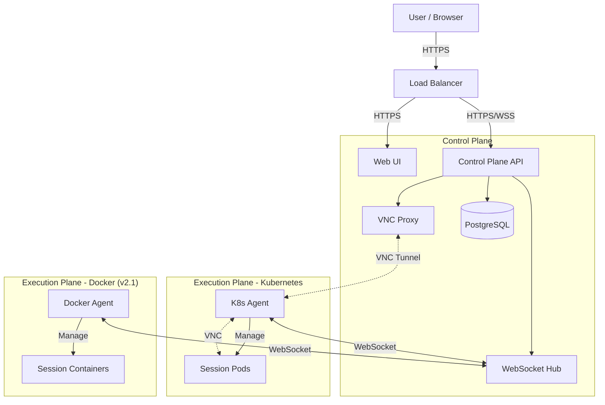

<div align="center">

# StreamSpace

**Stream any app to your browser**

*An open source, platform-agnostic container streaming platform*

[](https://opensource.org/licenses/MIT)
[](https://kubernetes.io/)
[](https://goreportcard.com/report/github.com/streamspace-dev/streamspace)
[](CHANGELOG.md)

[Features](#features) • [Quick Start](#quick-start) • [Architecture](#architecture) • [Documentation](#documentation) • [Contributing](#contributing)

</div>

---

> [!IMPORTANT]
> **Current Version: v2.0-beta (Integration Testing)**
>
> StreamSpace has completed a major architectural transformation to a multi-platform Control Plane + Agent model. The Kubernetes agent is fully functional with VNC proxy tunneling. We're currently in the production hardening phase with 57 tracked improvements across observability, security, performance, and UX.
>
> **📋 Project Board**: [StreamSpace v2.0 Development](https://github.com/orgs/streamspace-dev/projects/2)

## 🚀 Overview

StreamSpace delivers browser-based access to containerized applications. It features a central **Control Plane** (API/WebUI) that manages distributed **Agents** across various platforms (Kubernetes, Docker - planned for v2.1).

### What's New in v2.0-beta

- **✅ Multi-Platform Architecture**: Control Plane + Agent model
- **✅ Secure VNC Proxy**: WebSocket-based VNC tunneling through Control Plane
- **✅ K8s Agent**: Fully functional Kubernetes agent with session lifecycle management
- **✅ Modern UI**: Real-time agent monitoring with noVNC integration
- **🚧 Production Hardening** (v2.0-beta.1): Health checks, metrics, security improvements
- **🚧 Performance & UX** (v2.0-beta.2): Caching, code splitting, accessibility
- **📋 Future Roadmap**: Plugin marketplace, webhooks, multi-cloud support ([View Roadmap](.github/RECOMMENDATIONS_ROADMAP.md))

## ✨ Features

| Core Features | Enterprise Features |
| :--- | :--- |
| 🖥️ **Browser-based VNC** access | 🔐 **SSO**: SAML 2.0, OIDC, OAuth2 |
| 👥 **Multi-user** isolation | 🛡️ **MFA** with TOTP |
| 💾 **Persistent** home directories | 📝 **Audit Logging** & Compliance |
| 💤 **Auto-hibernation** (scale to zero) | 🌐 **IP Whitelisting** & Rate Limiting |
| 📦 **200+ Apps** via templates | 🔌 **Webhooks** (Slack, Teams, Discord) |

## 🛠️ Quick Start

### Prerequisites

- Kubernetes 1.19+ (k3s recommended)
- Helm 3.0+
- PostgreSQL database
- NFS storage provisioner

### Installation

1. **Clone the repository**

    ```bash
    git clone https://github.com/streamspace-dev/streamspace.git
    cd streamspace
    ```

2. **Deploy CRDs**

    ```bash
    kubectl apply -f manifests/crds/
    ```

3. **Install via Helm**

    ```bash
    helm install streamspace ./chart -n streamspace --create-namespace
    ```

4. **Create a Session**

    ```bash
    kubectl apply -f - <<EOF
    apiVersion: stream.space/v1alpha1
    kind: Session
    metadata:
      name: my-firefox
      namespace: streamspace
    spec:
      user: john
      template: firefox-browser
      state: running
      resources:
        memory: 2Gi
    EOF
    ```

> [!TIP]
> **Production Setup**: Before deploying to production, ensure you update the default secrets. See the [Deployment Guide](DEPLOYMENT.md) for details.

## 🎯 Production Readiness (v2.0-beta.1)

StreamSpace is currently undergoing production hardening. The following features are being implemented:

**🔒 Security** (P0 - Critical):
- Rate limiting to prevent abuse
- Comprehensive API input validation
- Security headers (HSTS, CSP, etc.)

**📊 Observability**:
- Health check endpoints for K8s probes
- Structured logging with trace IDs
- Prometheus metrics exposure
- Grafana dashboards

**⚡ Performance** (v2.0-beta.2):
- Database query optimization with indexes
- Redis caching layer
- Frontend code splitting
- Virtual scrolling for large lists

See the [complete roadmap](.github/RECOMMENDATIONS_ROADMAP.md) for all 57 tracked improvements across security, performance, testing, and features.

## 🏗️ Architecture

StreamSpace uses a **Control Plane + Agent** architecture for multi-platform support and scalability.



**Key Components**:
- **Control Plane**: Central management, authentication, VNC proxy
- **WebSocket Hub**: Real-time agent communication and coordination
- **VNC Proxy**: Secure tunneling of VNC traffic through Control Plane
- **K8s Agent**: Manages Kubernetes pods and sessions
- **Session Pods**: Isolated containerized environments with VNC

For detailed architecture, see [ARCHITECTURE.md](docs/ARCHITECTURE.md).

## 📚 Available Applications

Templates are available via [streamspace-templates](https://github.com/StreamSpace-dev/streamspace-templates).

- **Browsers**: Firefox, Chromium, Brave, LibreWolf
- **Development**: VS Code, GitHub Desktop
- **Productivity**: LibreOffice, OnlyOffice
- **Media**: GIMP, Blender, Audacity, Kdenlive

## 💻 Development

### Build Components

```bash
# Build K8s Agent
cd agents/k8s-agent && go build -o k8s-agent .

# Build API
cd api && go build -o streamspace-api

# Build UI
cd ui && npm install && npm run build
```

### Run Tests

```bash
# Run all integration tests
cd tests && ./scripts/run-integration-tests.sh
```

See [TESTING.md](TESTING.md) for detailed testing guides.

## 📖 Documentation

### User Guides
- **[FEATURES.md](FEATURES.md)**: Complete feature list & implementation status
- **[DEPLOYMENT.md](DEPLOYMENT.md)**: Production deployment guide
- **[ARCHITECTURE.md](docs/ARCHITECTURE.md)**: Deep dive into system design

### Development
- **[CONTRIBUTING.md](CONTRIBUTING.md)**: How to contribute
- **[TESTING.md](TESTING.md)**: Testing guides
- **[.github/RECOMMENDATIONS_ROADMAP.md](.github/RECOMMENDATIONS_ROADMAP.md)**: v2.0-v2.2 roadmap with 57 tracked improvements

### Project Management
- **[Project Board](https://github.com/orgs/streamspace-dev/projects/2)**: Live progress tracking
- **[Milestones](https://github.com/streamspace-dev/streamspace/milestones)**: Release planning
- **[Issues](https://github.com/streamspace-dev/streamspace/issues)**: Bug reports & feature requests

## 🤝 Contributing

Contributions are welcome! Please read [CONTRIBUTING.md](CONTRIBUTING.md) first.

1. Fork the repository
2. Create your feature branch (`git checkout -b feature/amazing-feature`)
3. Commit your changes (`git commit -m 'Add some amazing feature'`)
4. Push to the branch (`git push origin feature/amazing-feature`)
5. Open a Pull Request

## 📄 License

StreamSpace is licensed under the [MIT License](LICENSE).

---

<div align="center">
  <sub>Built with ❤️ by the StreamSpace Team</sub>
</div>
