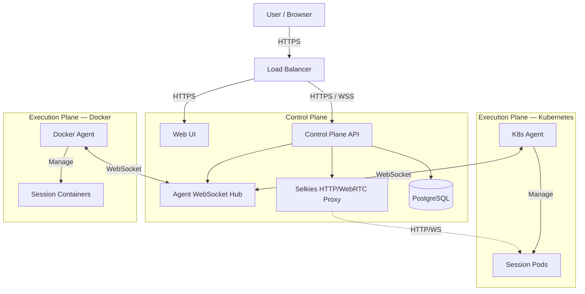

<div align="center">

# StreamSpace

**Stream any app to your browser**

*An open source, platform-agnostic container streaming platform*

[](https://opensource.org/licenses/MIT)
[](https://kubernetes.io/)
[](https://goreportcard.com/report/github.com/streamspace-dev/streamspace)

[Features](#features) • [Quick Start](#quick-start) • [Architecture](#architecture) • [Documentation](#documentation) • [Contributing](#contributing)

</div>

---

> [!WARNING]
> **Active rebuild — April 2026.** The control plane and agents work, but the end-to-end streaming pipeline (image build, template catalog wiring, golden-path test) is being reconstructed. The historical v2.0-beta.1 docs are preserved under [`docs/historical/`](docs/historical/) for context.

## Overview

StreamSpace delivers browser-based access to containerized applications. A central **Control Plane** (API + WebUI) brokers sessions to distributed **Agents** running on Kubernetes today and Docker next.

Streaming uses **Selkies-GStreamer (WebRTC)** end-to-end. Earlier VNC code paths were removed in favor of a single, well-supported protocol.

## Repository topology

| Repo | What it owns |
|---|---|
| `streamspace-dev/streamspace` (this repo) | Control Plane API, K8s/Docker agents, Web UI, Helm chart |
| `streamspace-dev/streamspace-templates` | Application templates (CRD manifests) **and** the source + build pipeline for custom container images (`ghcr.io/streamspace-dev/<image>`) |
| `streamspace-dev/streamspace-plugins` | Optional plugins (auth, storage, observability, billing, …) |
| `streamspace-dev/streamspace.wiki` | End-user documentation (Getting Started, Architecture overview, Plugin/Template catalogs) |

## Features

| Core | Enterprise |
| :--- | :--- |
| Browser-based streaming over WebRTC | SSO: SAML 2.0, OIDC, OAuth2 |
| Multi-tenancy with org scoping | MFA with TOTP |
| Persistent home directories | Audit logging & compliance |
| Auto-hibernation (scale to zero) | IP allow-listing & rate limiting |
| Custom image pipeline (cosign + SBOM) | Webhooks (16 event types) |
| Grafana dashboards | Prometheus alerts |

## Quick Start

> [!NOTE]
> This is the dev/contributor flow. For production deployment see [`docs/DEPLOYMENT.md`](docs/DEPLOYMENT.md).

### Prerequisites

- Kubernetes 1.19+ (k3s recommended for local dev)
- Helm 3.0+
- PostgreSQL database
- A storage class for persistent home volumes

### Install

```bash
git clone https://github.com/streamspace-dev/streamspace.git
cd streamspace
kubectl apply -f manifests/crds/
helm install streamspace ./chart -n streamspace --create-namespace
```

### Launch a session

```bash
kubectl apply -f - <<'EOF'
apiVersion: stream.space/v1alpha1
kind: Session
metadata:
  name: my-chrome
  namespace: streamspace
spec:
  user: john
  template: chrome-selkies
  state: running
  resources:
    memory: 2Gi
EOF
```

The `chrome-selkies` template is the seeded default. The control plane proxies `/api/v1/http/<session-id>/` to the session pod's Selkies endpoint on port 8080.

> [!TIP]
> Update default secrets before any production deployment — see [`docs/DEPLOYMENT.md`](docs/DEPLOYMENT.md).

## Architecture


```mermaid
graph TD
    User[User / Browser] -->|HTTPS| Ingress[Load Balancer]
    Ingress -->|HTTPS| UI[Web UI]
    Ingress -->|HTTPS / WSS| API[Control Plane API]

    subgraph "Control Plane"
        UI
        API
        Hub[Agent WebSocket Hub]
        Selkies[Selkies HTTP/WebRTC Proxy]
        DB[(PostgreSQL)]

        API --> DB
        API --> Hub
        API --> Selkies
    end

    subgraph "Execution Plane — Kubernetes"
        K8sAgent[K8s Agent]
        K8sAgent <-->|WebSocket| Hub
        K8sAgent -->|Manage| Pods[Session Pods]
        Selkies -.->|HTTP/WS| Pods
    end

    subgraph "Execution Plane — Docker"
        DockerAgent[Docker Agent]
        DockerAgent <-->|WebSocket| Hub
        DockerAgent -->|Manage| Containers[Session Containers]
    end
```

**Components**

- **Control Plane API** — auth, multi-tenancy, session orchestration, exposes the Selkies HTTP/WebRTC proxy.
- **Agent WebSocket Hub** — bidirectional command channel to agents (heartbeats, session start/stop, status updates).
- **Selkies Proxy** — token-authenticated reverse proxy from `/api/v1/http/<session>/` to the in-cluster Selkies endpoint on the session pod (port 8080). Sessions stream over the same connection via WebRTC.
- **K8s Agent** — manages Session/Template CRDs, deploys session pods, reports lifecycle.
- **Docker Agent** — equivalent for Docker hosts (in flight).

For the deeper technical reference, see [`docs/ARCHITECTURE.md`](docs/ARCHITECTURE.md). Frozen v2 architecture snapshots live in [`docs/historical/`](docs/historical/).

## Available applications

Templates live in [`streamspace-templates`](https://github.com/streamspace-dev/streamspace-templates). The image-build pipeline in that repo is set up to publish signed multi-arch images to `ghcr.io/streamspace-dev/<image>` with cosign signatures and SPDX SBOM attestations.

> [!WARNING]
> **No image is published yet.** The pipeline's first image source — `chrome-selkies` — references a base image (`ghcr.io/selkies-project/selkies-gstreamer:24.04`) that does not exist in the upstream registry. Both the post-merge CI run and a local build attempt failed at the docker pull step. Tracked in [streamspace-templates#3](https://github.com/streamspace-dev/streamspace-templates/issues/3). The `chrome-selkies` Dockerfile needs to be rewritten `FROM ubuntu:24.04` and install Selkies from the [release tarballs](https://github.com/selkies-project/selkies/releases) before any image becomes available.
>
> The Helm chart's seeded `default-apps-configmap.yaml` and the example session above point at `ghcr.io/streamspace-dev/chrome-selkies:latest` ahead of when it actually exists; deploys will pull-fail until the build is fixed.

A Selkies-native catalog (Firefox, VS Code, full desktops, etc.) is being added on top of the same pipeline.

## Development

```bash
# Build K8s Agent
cd agents/k8s-agent && go build -o k8s-agent .

# Build API
cd api && go build -o streamspace-api ./cmd

# Build UI
cd ui && npm install && npm run build

# Run all Go tests under -race
go test -race ./...
```

See [`docs/TESTING.md`](docs/TESTING.md) for the full test guide.

## Documentation

### Contributor-facing (this repo)

- [`docs/ARCHITECTURE.md`](docs/ARCHITECTURE.md) — system design
- [`docs/DEPLOYMENT.md`](docs/DEPLOYMENT.md) — production deployment
- [`docs/MIGRATION_V1_TO_V2.md`](docs/MIGRATION_V1_TO_V2.md) — v1 → v2 migration
- [`docs/design/architecture/`](docs/design/architecture/) — architecture decision records
- [`docs/historical/`](docs/historical/) — frozen architectural snapshots
- [`CONTRIBUTING.md`](CONTRIBUTING.md) · [`ROADMAP.md`](ROADMAP.md) · [`FEATURES.md`](FEATURES.md)

### End-user-facing

- [streamspace.wiki](https://github.com/streamspace-dev/streamspace.wiki) — Getting Started, deployment, plugin/template catalogs

### API

- Swagger UI at `/api/docs` (when API is running)
- [`docs/API_REFERENCE.md`](docs/API_REFERENCE.md)

## Contributing

Contributions welcome — start with [`CONTRIBUTING.md`](CONTRIBUTING.md). The workflow is the standard fork → branch → PR pattern; see the project's [issue board](https://github.com/streamspace-dev/streamspace/issues) for triaged work.

## License

StreamSpace is licensed under the [MIT License](LICENSE).

---

<div align="center">
  <sub>Built with ❤️ by the StreamSpace Team</sub>
</div>
