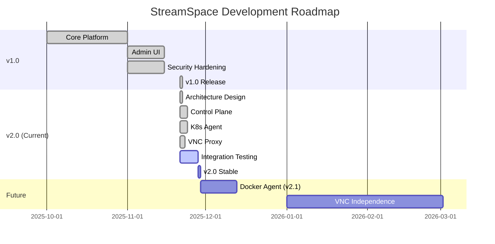

# 🗺️ StreamSpace Roadmap

**Current Version**: v2.0-beta • **Last Updated**: 2025-11-23

---

> [!WARNING]
> **Current Status: v2.0-beta (Testing Phase - NOT Production Ready)**
>
> StreamSpace has completed the v2.0 architecture implementation (Control Plane + Multi-Platform Agents) but is experiencing a **test coverage crisis**. See [TEST_STATUS.md](TEST_STATUS.md) for details and remediation plan.
>
> **Critical**: API at 4% coverage, both agents at 0% coverage, 136 UI tests failing.

> [!NOTE]
> For detailed production hardening roadmap with 57 tracked improvements, see [.github/RECOMMENDATIONS_ROADMAP.md](.github/RECOMMENDATIONS_ROADMAP.md)

## 📅 Release Timeline

## 🎯 Priorities

### 1. Fix Broken Test Infrastructure (P0 - CRITICAL)

- **Current**: Test suites failing, blocking all validation
- **Issues**: [#157](https://github.com/streamspace-dev/streamspace/issues/157), [#200-207](https://github.com/streamspace-dev/streamspace/issues)
- **Timeline**: 1-2 days
- **Tasks**:
  - [ ] Fix API handler test panics ([#204](https://github.com/streamspace-dev/streamspace/issues/204))
  - [ ] Fix K8s agent test compilation ([#203](https://github.com/streamspace-dev/streamspace/issues/203))
  - [ ] Fix UI component import errors ([#207](https://github.com/streamspace-dev/streamspace/issues/207))
  - [ ] Fix WebSocket & Services test builds ([#204](https://github.com/streamspace-dev/streamspace/issues/204))

### 2. Critical Test Coverage (P0 - High Priority)

- **Current**: API 4%, K8s Agent 0%, Docker Agent 0%, UI 32%
- **Target v2.0-beta.1**: API 40%, Agents 60%, UI 60%
- **Timeline**: 10-15 days (Phases 2-4 from TEST_STATUS.md)
- **Tasks**:
  - [ ] Docker Agent test suite - 2,100 lines untested ([#201](https://github.com/streamspace-dev/streamspace/issues/201))
  - [ ] K8s Agent test suite - Leader election, VNC tunneling ([#203](https://github.com/streamspace-dev/streamspace/issues/203))
  - [ ] AgentHub multi-pod tests - Redis, cross-pod routing ([#202](https://github.com/streamspace-dev/streamspace/issues/202))
  - [ ] API handler tests - Session, VNC proxy, template endpoints ([#204](https://github.com/streamspace-dev/streamspace/issues/204))

### 3. Integration & E2E Testing (P1 - High Priority)

- **Focus**: Validate complete v2.0 architecture end-to-end
- **Timeline**: 3-4 days (Phase 5 from TEST_STATUS.md)
- **Tasks**:
  - [ ] VNC streaming E2E (Browser → Proxy → Agent → Container) ([#157](https://github.com/streamspace-dev/streamspace/issues/157))
  - [ ] Multi-pod API failover scenarios
  - [ ] Agent leader election and failover
  - [ ] Cross-platform session management (K8s + Docker)
  - [ ] Performance benchmarking (session creation, VNC latency)

### 4. Production Hardening (v2.0-beta.1 - P1)

- **Current**: 57 improvements tracked in [RECOMMENDATIONS_ROADMAP.md](.github/RECOMMENDATIONS_ROADMAP.md)
- **Target v2.0-beta.1**: Security + Observability basics
- **Timeline**: ~20 hours after tests fixed
- **Priority Tasks**:
  - [ ] Health check endpoints ([#158](https://github.com/streamspace-dev/streamspace/issues/158))
  - [ ] Security headers ([#165](https://github.com/streamspace-dev/streamspace/issues/165))
  - [ ] Rate limiting ([#163](https://github.com/streamspace-dev/streamspace/issues/163))
  - [ ] Structured logging ([#159](https://github.com/streamspace-dev/streamspace/issues/159))
  - [ ] Prometheus metrics ([#160](https://github.com/streamspace-dev/streamspace/issues/160))

### 5. Plugin Implementation (P2 - Medium Priority)

- **Current**: Framework complete, 28 stub plugins, 0% tested
- **Target**: Working implementations for top 10 plugins
- **Priority**: Deferred until after test coverage fixed
- **Top Plugins**:
  - Calendar, Slack, Teams, Discord, PagerDuty
  - Compliance, DLP, Analytics

## 🛤️ Detailed Roadmap

### v1.0.0-READY (Completed) ✅

- **Core**: Functional Kubernetes platform
- **Auth**: Complete authentication stack (SAML, OIDC, MFA)
- **Admin**: Full admin UI and configuration
- **Security**: Production-hardened (Audit logs, RBAC, Security headers)

### v2.0-beta (Current - Testing Phase) ⚠️

**Status**: Architecture complete, test coverage crisis

**Completed**:
- ✅ Multi-platform Control Plane + Agent architecture
- ✅ Secure VNC Proxy (WebSocket tunneling, firewall-friendly)
- ✅ Kubernetes Agent (session lifecycle, leader election, VNC tunneling)
- ✅ Docker Agent (container lifecycle, HA backends)
- ✅ Multi-pod API (Redis-backed AgentHub)
- ✅ Real-time agent monitoring UI

**Blocked**:
- ❌ **Test Infrastructure** - Multiple test suites broken ([#200](https://github.com/streamspace-dev/streamspace/issues/200))
- ❌ **Test Coverage** - 4% API, 0% agents, 32% UI ([TEST_STATUS.md](TEST_STATUS.md))
- ❌ **Production Readiness** - Cannot deploy without tests

**Next**: Fix broken tests (1-2 days) → Comprehensive test coverage (10-15 days) → Production hardening (~20 hours)

### v2.0-beta.1 (Target: After Test Coverage) 📝

**Prerequisites**:
- Test infrastructure fixed
- API 40%+ coverage
- Agents 60%+ coverage
- Integration tests passing

**Goals**:
- Production-ready security (rate limiting, input validation, security headers)
- Observability basics (health checks, structured logging, Prometheus metrics)
- Validated HA features (multi-pod API, agent leader election)
- Performance benchmarks documented

### v2.1 (Future) 🔮

- **Performance**: Redis caching, database optimization, frontend code splitting
- **UX**: Accessibility improvements, virtual scrolling, bulk operations
- **Features**: Plugin marketplace, advanced webhooks, multi-cloud support

### v3.0 (Future) 🔮

- **Streaming**: WebRTC support for lower latency
- **VNC**: Migration to TigerVNC + noVNC (native images)
- **Hardware**: GPU acceleration support
- **Federation**: Multi-cluster support

## 🤝 How to Contribute

We welcome contributions! Here are the high-impact areas:

1. **Testing**: Help us reach our 80% coverage goal.
2. **Plugins**: Pick a stub plugin and implement it.
3. **Documentation**: Improve guides and examples.

See [CONTRIBUTING.md](CONTRIBUTING.md) for details.

---

  StreamSpace Roadmap

