<div align="center">

# 🏗️ StreamSpace Architecture

**Version**: v2.0-beta.1 • **Last Updated**: 2025-11-23

[](../CHANGELOG.md)

</div>

---

> [!IMPORTANT]
> **v2.0 Architecture Update**
>
> StreamSpace has evolved to a **Control Plane + Agent** architecture. The Control Plane acts as the central management hub, while Agents (Kubernetes, Docker, etc.) execute commands and manage resources on their respective platforms.

## 🧩 System Overview

StreamSpace is a platform-agnostic container streaming platform. It separates the management logic (Control Plane) from the execution logic (Agents), allowing for scalability and multi-platform support.

### High-Level Architecture


## 🔴 High Availability Architecture (v2.0-beta.1)

StreamSpace v2.0-beta.1 introduces comprehensive High Availability (HA) features for production deployments, ensuring zero downtime during component failures and seamless horizontal scaling.

### HA Components Overview

| Component | HA Feature | Replicas | Backend |
|-----------|-----------|----------|---------|
| **Control Plane API** | Multi-pod deployment with Redis-backed AgentHub | 2-10 pods | Redis |
| **K8s Agent** | Leader election via Kubernetes leases | 3-10 replicas | Kubernetes leases API |
| **Docker Agent** | Leader election with pluggable backends | 2-10 instances | File / Redis / Swarm |
| **PostgreSQL** | External HA database recommended | N/A | PostgreSQL HA (Patroni, etc.) |
| **Redis** | Sentinel or Cluster mode for production | 3+ nodes | Redis Sentinel/Cluster |

### Redis-Backed AgentHub Architecture

The **AgentHub** is the WebSocket connection manager for all agents. In HA deployments, it uses Redis to coordinate agent connections across multiple API pods.


**Key Features:**
- **Shared Agent Registry**: All API pods see all connected agents via Redis.
- **Connection Routing**: Agents connect to any API pod; requests route correctly.
- **Failover**: If an API pod dies, agents reconnect to another pod (23s avg reconnection).
- **Session Survival**: 100% session survival during API pod failover (tested in Wave 14).

**Redis Data Structures:**
```
streamspace:agents:{platform}:{name} -> Agent metadata (JSON)
streamspace:agents:connections:{agent_id} -> Connected API pod ID
streamspace:agents:heartbeats:{agent_id} -> Last heartbeat timestamp
```

### Multi-Pod Control Plane Deployment


**Scaling Configuration:**
- **Min Replicas**: 2 (for HA)
- **Max Replicas**: 10 (recommended)
- **Target CPU**: 70% utilization
- **Session Affinity**: Sticky sessions for WebSocket connections (required for VNC)

**Deployment Command:**
```bash
helm install streamspace ./chart \
  --set api.replicas=3 \
  --set api.redis.enabled=true \
  --set api.autoscaling.enabled=true \
  --set api.autoscaling.maxReplicas=10
```

### K8s Agent Leader Election

The Kubernetes Agent uses **Kubernetes lease-based leader election** to ensure only one agent actively manages resources at a time, while followers remain ready for failover.

```mermaid
sequenceDiagram
    participant Agent1 as K8s Agent 1
    participant Agent2 as K8s Agent 2
    participant Agent3 as K8s Agent 3
    participant K8sAPI as Kubernetes API
    participant ControlPlane as Control Plane

    Agent1->>K8sAPI: Try Acquire Lease "k8s-agent-leader"
    K8sAPI-->>Agent1: ✅ Lease Acquired (Leader)
    Agent1->>ControlPlane: Register (is_leader: true)

    Agent2->>K8sAPI: Try Acquire Lease "k8s-agent-leader"
    K8sAPI-->>Agent2: ❌ Lease Held by Agent1 (Follower)
    Agent2->>ControlPlane: Register (is_leader: false)

    Agent3->>K8sAPI: Try Acquire Lease "k8s-agent-leader"
    K8sAPI-->>Agent3: ❌ Lease Held by Agent1 (Follower)
    Agent3->>ControlPlane: Register (is_leader: false)

    loop Every 10s (Renew Deadline)
        Agent1->>K8sAPI: Renew Lease
        K8sAPI-->>Agent1: ✅ Lease Renewed
    end

    Note over Agent1: Agent1 Crashes!
    Agent1-xControlPlane: WebSocket Disconnect

    Agent2->>K8sAPI: Try Acquire Lease (after 15s lease expiry)
    K8sAPI-->>Agent2: ✅ Lease Acquired (New Leader)
    Agent2->>ControlPlane: Update (is_leader: true)
    Note over Agent2: Agent2 is now Leader!

    ControlPlane->>Agent2: Route Commands to New Leader
```



**Leader Election Parameters:**
- **Lease Duration**: 15s (time before lease expires)
- **Renew Deadline**: 10s (leader renews lease every 10s)
- **Retry Period**: 2s (followers check every 2s)
- **Lease Name**: `k8s-agent-leader` (namespace: `streamspace`)

**Failover Timing:**
- **Detection**: 15s (lease expiry timeout)
- **Election**: 2-4s (follower acquires lease)
- **Reconnection**: 23s average (tested in Wave 14)
- **Session Impact**: 0% session loss (100% survival)

### Docker Agent HA Backends

The Docker Agent supports **three HA backends** for leader election, allowing flexible deployment models.

```mermaid
graph TD
    subgraph "File Backend (Single Host)"
        DockerAgent1[Docker Agent 1]
        DockerAgent2[Docker Agent 2]
        FileBackend[/shared/leader.lock]
        DockerAgent1 <-.->|Flock| FileBackend
        DockerAgent2 <-.->|Flock| FileBackend
    end

    subgraph "Redis Backend (Multi-Host) - RECOMMENDED"
        DockerAgent3[Docker Agent 3<br/>Host A]
        DockerAgent4[Docker Agent 4<br/>Host B]
        RedisBackend[(Redis<br/>Distributed Lock)]
        DockerAgent3 <-.->|SETNX| RedisBackend
        DockerAgent4 <-.->|SETNX| RedisBackend
    end

    subgraph "Swarm Backend (Docker Swarm)"
        DockerAgent5[Docker Agent 5<br/>Swarm Node]
        DockerAgent6[Docker Agent 6<br/>Swarm Node]
        SwarmBackend[Docker Swarm<br/>Service Constraint]
        DockerAgent5 <-.->|Service Replica 1| SwarmBackend
        DockerAgent6 <-.->|Service Replica 2| SwarmBackend
    end
```

**Backend Comparison:**

| Backend | Use Case | Replicas | Failover Time | Pros | Cons |
|---------|----------|----------|---------------|------|------|
| **File** | Single host, shared filesystem | 2-4 | 15s | Simple, no dependencies | Single point of failure (filesystem) |
| **Redis** | Multi-host, distributed | 2-10 | 15s | Distributed, production-ready | Requires Redis |
| **Swarm** | Docker Swarm environments | 2-10 | 30s | Native Swarm integration | Requires Swarm mode |

**Configuration Examples:**

**File Backend:**
```bash
# /etc/systemd/system/streamspace-docker-agent.service
Environment="ENABLE_HA=true"
Environment="HA_BACKEND=file"
Environment="FILE_LOCK_PATH=/var/lib/streamspace/leader.lock"
Environment="LEASE_DURATION=15s"
```

**Redis Backend (Recommended):**
```bash
Environment="ENABLE_HA=true"
Environment="HA_BACKEND=redis"
Environment="REDIS_URL=redis://redis.example.com:6379"
Environment="LEASE_KEY=docker-agent-leader"
Environment="LEASE_DURATION=15s"
```

**Swarm Backend:**
```yaml
# docker-compose.yml (Swarm mode)
services:
  streamspace-docker-agent:
    image: streamspace/docker-agent:v2.0-beta.1
    deploy:
      mode: replicated
      replicas: 3
    environment:
      ENABLE_HA: "true"
      HA_BACKEND: "swarm"
```

### HA Deployment Topology

Complete HA deployment topology showing all components with recommended replica counts:

```mermaid
graph TB
    subgraph "External Load Balancer"
        LB[Ingress / ALB<br/>TLS Termination]
    end

    subgraph "Kubernetes Cluster - Control Plane Namespace"
        subgraph "API Pods (2-10 replicas)"
            API1[API Pod 1]
            API2[API Pod 2]
            API3[API Pod 3]
        end

        UI[Web UI Pod]
        Redis[(Redis<br/>3-node Sentinel)]
        DB[(PostgreSQL<br/>HA w/ Patroni)]

        API1 <--> Redis
        API2 <--> Redis
        API3 <--> Redis

        API1 --> DB
        API2 --> DB
        API3 --> DB
    end

    subgraph "Kubernetes Cluster - Agent Namespace"
        subgraph "K8s Agent Pods (3-10 replicas)"
            K8sLeader[K8s Agent 1<br/>👑 Leader]
            K8sFollower1[K8s Agent 2<br/>Follower]
            K8sFollower2[K8s Agent 3<br/>Follower]
        end

        Lease[Kubernetes Lease<br/>"k8s-agent-leader"]

        K8sLeader -.->|Holds| Lease
        K8sFollower1 -.->|Watches| Lease
        K8sFollower2 -.->|Watches| Lease
    end

    subgraph "Kubernetes Cluster - Sessions Namespace"
        Pod1[Session Pod 1]
        Pod2[Session Pod 2]
        PodN[Session Pod N]
    end

    subgraph "Docker Hosts (2-10 instances)"
        subgraph "Host A"
            DockerLeader[Docker Agent 1<br/>👑 Leader]
            Container1[Session Container 1]
            Container2[Session Container 2]
        end

        subgraph "Host B"
            DockerFollower[Docker Agent 2<br/>Follower]
        end

        RedisHA[(Redis HA<br/>Leader Election)]
        DockerLeader <-.->|Holds Lock| RedisHA
        DockerFollower <-.->|Watches Lock| RedisHA
    end

    LB --> UI
    LB --> API1
    LB --> API2
    LB --> API3

    K8sLeader <-->|WebSocket| API1
    K8sFollower1 <-->|WebSocket| API2
    K8sFollower2 <-->|WebSocket| API3

    DockerLeader <-->|WebSocket| API1
    DockerFollower <-->|WebSocket| API2

    K8sLeader -->|Manage| Pod1
    K8sLeader -->|Manage| Pod2
    K8sLeader -->|Manage| PodN

    DockerLeader -->|Manage| Container1
    DockerLeader -->|Manage| Container2
```

**Production HA Checklist:**

- ✅ **Control Plane**: 3+ API pods, Redis Sentinel (3+ nodes), PostgreSQL HA
- ✅ **K8s Agent**: 3+ replicas with leader election enabled
- ✅ **Docker Agent**: 2+ instances with Redis backend
- ✅ **Load Balancer**: Session affinity enabled for WebSocket
- ✅ **Monitoring**: Prometheus alerts for leader election failures
- ✅ **Backup**: Regular PostgreSQL backups and Redis snapshots

## 📦 Core Components

### 1. Control Plane (API)

- **Role**: Central brain of the system.
- **Tech**: Go (Gin framework).
- **Responsibilities**:
  - User Authentication & Authorization (SAML, OIDC).
  - Session Management (CRUD).
  - Agent Coordination (WebSocket Hub).
  - VNC Proxying (Secure tunneling).
  - Database Management.

### 2. Execution Agents

- **Role**: Platform-specific executors.
- **Tech**: Go.
- **Types**:
  - **Kubernetes Agent**: Manages Pods, PVCs, Services with leader election (v2.0-beta.1).
  - **Docker Agent**: Manages Containers, Volumes with HA backends (v2.0-beta.1).
- **Responsibilities**:
  - Connect to Control Plane via secure WebSocket.
  - Execute commands (Start, Stop, Hibernate).
  - Report status and metrics (Heartbeats).
  - Tunnel VNC traffic.
  - Participate in leader election for High Availability.

### 3. Web UI

- **Role**: User interface.
- **Tech**: React + TypeScript + Material-UI.
- **Features**:
  - Dashboard & Catalog.
  - Session Viewer (noVNC integration).
  - Admin Panel (User, Agent, Plugin management).

### 4. Session Workspaces

- **Role**: The actual user environment.
- **Tech**: Containerized applications (LinuxServer.io images).
- **Features**:
  - KasmVNC for streaming.
  - Persistent home directory.
  - Isolated environment.

## 🔄 Data Flow

### Session Creation


### VNC Streaming (v2.0 Proxy)


## 🛡️ Security Architecture

### Authentication

- **SSO**: Authentik, Okta, Azure AD via OIDC/SAML.
- **Tokens**: JWT (Access + Refresh).
- **MFA**: TOTP support.

### Network Security

- **Ingress**: TLS/SSL enforced.
- **Isolation**: Network Policies deny inter-pod traffic by default.
- **Proxy**: All VNC traffic flows through Control Plane (no direct pod access).

### Data Protection

- **Storage**: Per-user PVCs with RBAC.
- **Encryption**: Secrets management for sensitive data.
- **Audit**: Comprehensive logging of all actions.

## 💾 Resource Management

### Quotas

- **Per User**: Max sessions, CPU, Memory.
- **Enforcement**: Checked at API level before command dispatch.

### Hibernation

- **Auto-Scale**: Idle sessions scale to 0 replicas.
- **Wake**: Instant resume on user interaction.
- **Persistence**: PVCs remain mounted/available.

## 🔌 Plugin System

The plugin system allows extending functionality without modifying the core.

- **Types**: Extension, Webhook, Integration, Theme.
- **Storage**: JSONB configuration in database.
- **Events**: Plugins can subscribe to system events (SessionStart, UserLogin, etc.).

---

<div align="center">
  <sub>StreamSpace Architecture Documentation</sub>
</div>
