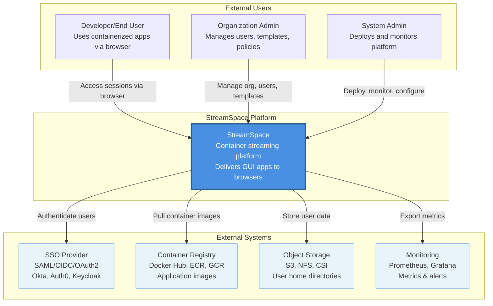
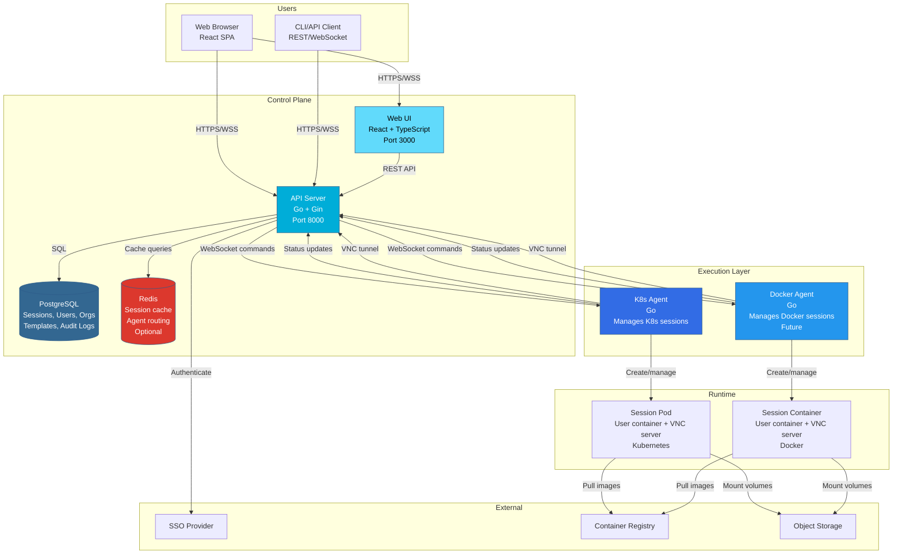
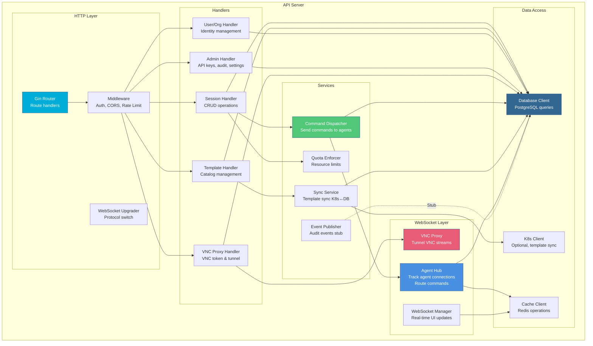
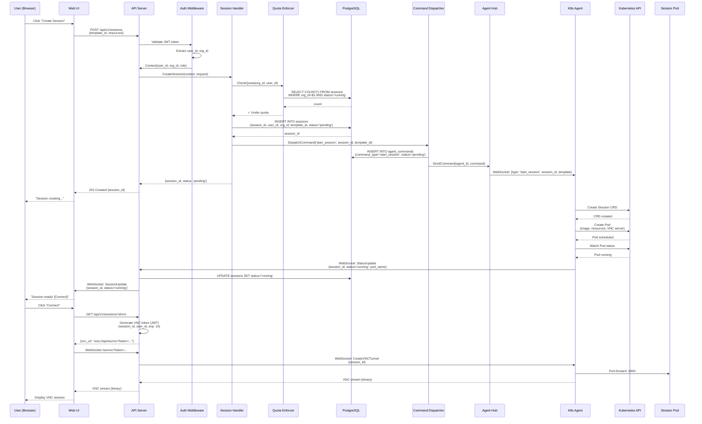
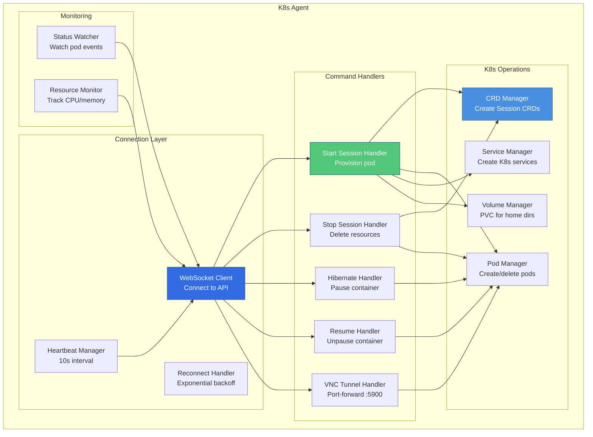
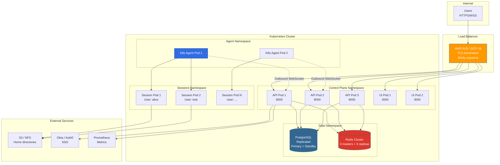

# C4 Model Architecture Diagrams

**Version**: v2.0-beta
**Last Updated**: 2025-11-26
**Owner**: Agent 1 (Architect)
**Status**: Living Document

---

## Introduction

This document provides C4 model architecture diagrams for StreamSpace using Mermaid notation. The C4 model (Context, Containers, Components, Code) provides a hierarchical way to visualize software architecture at different levels of abstraction.

**Reference**: [C4 Model](https://c4model.com/) by Simon Brown

---

## Level 1: System Context Diagram

Shows StreamSpace in the context of its users and external systems.

### Key Relationships

1. **Users → StreamSpace**:
   - Developers access containerized applications via web browser (VNC over WebSocket)
   - Org Admins manage organizational resources, users, and policies via Web UI
   - System Admins deploy platform, monitor health, configure settings

2. **StreamSpace → External Systems**:
   - **SSO Integration**: Delegates authentication to enterprise identity providers
   - **Container Registry**: Pulls application images for session provisioning
   - **Object Storage**: Persists user home directories and session data
   - **Monitoring**: Exports metrics and logs for observability

---

## Level 2: Container Diagram

Shows the major containers (applications/services) within StreamSpace and their interactions.

### Container Descriptions

#### Control Plane Containers

1. **Web UI** (React + TypeScript)
   - **Technology**: React 18, Material-UI, TypeScript
   - **Port**: 3000 (development), served via API in production
   - **Purpose**: User interface for session management, org admin, system settings
   - **Communication**: REST API (sessions, templates, users), WebSocket (real-time updates)

2. **API Server** (Go + Gin)
   - **Technology**: Go 1.21+, Gin web framework
   - **Port**: 8000
   - **Purpose**: Central control plane - authentication, authorization, session lifecycle, VNC proxy
   - **Communication**:
     - Inbound: HTTPS/REST (UI, CLI), WebSocket (agents, VNC clients)
     - Outbound: PostgreSQL (state), Redis (cache), SSO (auth), agents (commands)

3. **PostgreSQL Database**
   - **Technology**: PostgreSQL 14+
   - **Purpose**: Canonical source of truth (see ADR-006)
   - **Schema**: Sessions, Users, Organizations, Templates, APIKeys, AuditLogs, AgentCommands
   - **Backup**: Daily snapshots, WAL archiving

4. **Redis Cache** (Optional)
   - **Technology**: Redis 7+
   - **Purpose**:
     - Session data cache (reduce DB load)
     - Agent routing (multi-pod API, see ADR-005)
     - Rate limiting counters
   - **Persistence**: Optional (cache can fail open)

#### Execution Layer Containers

5. **Kubernetes Agent** (Go)
   - **Technology**: Go 1.21+, Kubernetes client-go
   - **Purpose**: Provisions and manages sessions on Kubernetes clusters
   - **Communication**:
     - Outbound WebSocket to API (commands, status updates)
     - K8s API (create CRDs, pods, services)
     - Port-forward to session pods (VNC tunnel)

6. **Docker Agent** (Go) - Future (v2.1+)
   - **Technology**: Go 1.21+, Docker SDK
   - **Purpose**: Provisions and manages sessions on Docker hosts
   - **Communication**:
     - Outbound WebSocket to API
     - Docker daemon (create containers, networks)

#### Runtime Containers

7. **Session Pod/Container**
   - **Technology**: User-defined application + VNC server (TigerVNC, x11vnc)
   - **Purpose**: Runs user's containerized application with GUI access
   - **Networking**: VNC server on port 5900 (internal), tunneled via agent → API → browser

---

## Level 3: Component Diagram (API Server)

Shows the internal components of the API Server container.

### Component Descriptions

#### HTTP Layer

1. **Gin Router**
   - Routes: `/api/v1/sessions`, `/api/v1/templates`, `/api/v1/users`, `/api/v1/admin`
   - WebSocket routes: `/ws/agent`, `/ws/vnc`, `/ws/ui`

2. **Middleware**
   - **Auth Middleware**: JWT validation, org context extraction (see ADR-004)
   - **CORS**: Cross-origin configuration for UI
   - **Rate Limiting**: Per-user, per-org, per-IP limits
   - **Logging**: Structured logging with request ID correlation

3. **WebSocket Upgrader**
   - HTTP → WebSocket protocol upgrade
   - Connection validation, origin checks

#### Handlers (REST API)

4. **Session Handler** (`api/internal/handlers/sessions.go`)
   - `POST /api/v1/sessions` - Create session (validate quota → dispatch command)
   - `GET /api/v1/sessions` - List sessions (org-scoped, see ADR-004)
   - `GET /api/v1/sessions/:id` - Get session details
   - `DELETE /api/v1/sessions/:id` - Stop session (dispatch stop command)
   - `POST /api/v1/sessions/:id/hibernate` - Hibernate session
   - `POST /api/v1/sessions/:id/resume` - Resume hibernated session

5. **Template Handler** (`api/internal/handlers/sessiontemplates.go`)
   - `GET /api/v1/templates` - List templates (org-scoped)
   - `POST /api/v1/templates` - Create template
   - `PUT /api/v1/templates/:id` - Update template
   - `DELETE /api/v1/templates/:id` - Delete template

6. **User/Org Handler** (`api/internal/handlers/users.go`, `organizations.go`)
   - User CRUD, org management, RBAC assignment

7. **VNC Handler** (`api/internal/handlers/vnc_proxy.go`)
   - `GET /api/v1/sessions/:id/vnc` - Generate VNC token (JWT)
   - `WebSocket /ws/vnc` - VNC proxy endpoint (see ADR-008)

8. **Admin Handler** (`api/internal/handlers/apikeys.go`, `audit.go`, `configuration.go`)
   - API key management, audit log queries, system settings

#### Services

9. **Command Dispatcher** (`api/internal/services/command_dispatcher.go`)
   - Creates commands in `agent_commands` table
   - Sends commands to agents via AgentHub
   - Handles command retry on agent reconnect
   - See ADR-005 (WebSocket Command Dispatch)

10. **Event Publisher** (`api/internal/events/stub.go`)
    - Stub implementation (NATS removed, see ADR-005)
    - Audit events written directly to database

11. **Sync Service** (`api/internal/services/sync_service.go`)
    - Syncs templates from K8s CRDs to database (one-time import)
    - Optional reconciliation loop (future)

12. **Quota Enforcer** (`api/internal/services/quota_enforcer.go`)
    - Validates session creation against org quotas
    - Resource limits (max sessions, CPU, memory)

#### WebSocket Layer

13. **Agent Hub** (`api/internal/websocket/agent_hub.go`)
    - Tracks active agent WebSocket connections (`agent_id → WebSocket`)
    - Routes commands to specific agents
    - Handles agent registration, heartbeat, disconnection
    - Multi-pod support via Redis (Issue #211)

14. **VNC Proxy** (`api/internal/handlers/vnc_proxy.go`)
    - Validates VNC tokens (JWT)
    - Proxies VNC stream: User ↔ API ↔ Agent ↔ Session
    - See ADR-008 (VNC Proxy via Control Plane)

15. **WebSocket Manager** (`api/internal/websocket/manager.go`)
    - Real-time updates to UI clients
    - Session state changes, metrics updates
    - Org-scoped broadcasts (see ADR-004 multi-tenancy fix)

#### Data Access

16. **Database Client** (`api/internal/db/`)
    - PostgreSQL queries via pgx driver
    - Org-scoped queries (WHERE org_id = $1)
    - Connection pooling, prepared statements

17. **Cache Client** (`api/internal/cache/`)
    - Redis operations (GET, SET, HGETALL, PUBLISH/SUBSCRIBE)
    - Agent routing, session cache, rate limiting

18. **K8s Client** (optional)
    - Used for template sync only
    - Can be nil (see ADR-006: Database as Source of Truth)

---

## Level 4: Code Diagram (Session Creation Flow)

Detailed sequence diagram for session creation (most critical flow).

### Key Observations

1. **Asynchronous Flow**: Session creation returns immediately (201 Created), actual provisioning happens asynchronously
2. **Org-Scoped Security**: Auth middleware extracts `org_id` from JWT, enforced in all DB queries
3. **Command Persistence**: Commands stored in database for retry on agent reconnect
4. **Real-Time Updates**: WebSocket pushes session status changes to UI
5. **VNC Token Security**: Short-lived JWT (1 hour expiry) for VNC access

---

## Component Diagram (Kubernetes Agent)

---

## Deployment View

Shows physical deployment topology for production.

### Deployment Characteristics

1. **High Availability**:
   - API: 3+ pods with horizontal autoscaling
   - PostgreSQL: Primary + synchronous standby
   - Redis: Cluster mode (3 masters, 3 replicas)

2. **Network Isolation**:
   - Control Plane namespace: Public-facing services
   - Sessions namespace: Isolated user workloads
   - Agent namespace: Management plane

3. **Persistence**:
   - Database: Persistent volumes (SSD, replicated)
   - Session storage: NFS/S3 (shared across pods)

4. **Scalability**:
   - Agents connect to any API pod (sticky sessions for VNC)
   - Redis-backed AgentHub routes commands across pods

---

## Diagram Maintenance

### Update Triggers

Update these diagrams when:
1. New major component added (e.g., Docker Agent, Plugin System)
2. Communication patterns change (e.g., new WebSocket protocol)
3. External integrations added (e.g., Vault for secrets)
4. Deployment topology changes (e.g., multi-cluster support)

### Ownership

- **Level 1 (Context)**: Architect (Agent 1)
- **Level 2 (Containers)**: Architect + Builder (Agent 2)
- **Level 3 (Components)**: Builder (Agent 2)
- **Level 4 (Code)**: Builder (Agent 2)
- **Deployment View**: Architect + SRE

### Review Cadence

- **Major releases** (v2.0, v3.0): Full review
- **Minor releases** (v2.1, v2.2): Update as needed
- **Quarterly**: Validate accuracy against implementation

---

## References

- **C4 Model**: https://c4model.com/
- **Mermaid Syntax**: https://mermaid.js.org/
- **Related ADRs**:
  - ADR-005: WebSocket Command Dispatch
  - ADR-006: Database as Source of Truth
  - ADR-007: Agent Outbound WebSocket
  - ADR-008: VNC Proxy via Control Plane
- **Implementation**:
  - `api/internal/` - API server components
  - `agents/k8s-agent/` - Kubernetes agent
  - `ui/src/` - Web UI

---

**Version History**:
- **v1.0** (2025-11-26): Initial C4 diagrams for v2.0-beta
- **Next Review**: v2.1 release (Q1 2026)
